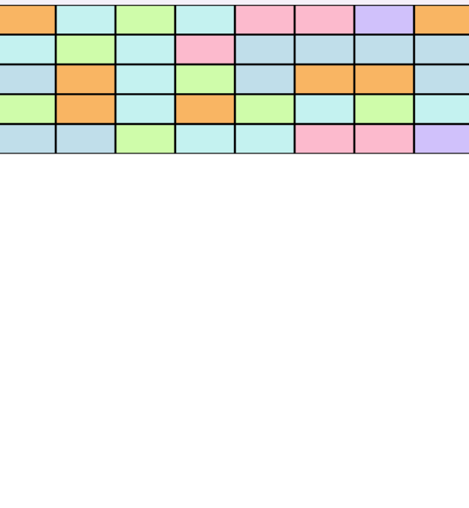

# Lezione 2 — Creare i blocchi colorati in alto

## Obiettivo dell’esercizio
L’obiettivo è capire come usare i rettangoli (`pygame.Rect`), disporli in griglia e assegnare colori casuali, posizionandoli in alto nello schermo di gioco :)


### Risultato atteso:

* I blocchi vengono generati automaticamente in base al numero di righe e colonne.
* Ogni blocco ha un colore scelto casualmente.
* I blocchi vengono disegnati sullo schermo sopra il paddle e la pallina.

---

## Concetti chiave

### 1. Uso di `pygame.Rect`

`pygame.Rect` è un oggetto che rappresenta un rettangolo, definito da coordinate **(x, y)** e dimensioni **(larghezza, altezza)**.
Nel nostro caso ogni blocco è un `Rect`.

Esempio:

```python
rect = pygame.Rect(col * BLOCK_WIDTH, row * BLOCK_HEIGHT, BLOCK_WIDTH, BLOCK_HEIGHT)
```

Questo crea un rettangolo posizionato alla colonna e riga corrispondente.

---

### 2. Posizionamento in griglia (righe e colonne)

Usiamo due cicli `for` annidati:

```python
for row in range(BLOCK_ROWS):
    for col in range(BLOCK_COLS):
```

Ogni iterazione crea un blocco in posizione diversa sulla base della **riga** e **colonna**.

---

### 3. Colori casuali

Con la libreria `random`, scegliamo un colore a caso da una lista predefinita:

```python
color = random.choice(colors)
```

Esempio lista colori:

```python
colors = [(192, 222, 234), (252, 186, 205), (208, 193, 251), (249, 181, 99), (196, 242, 240), (207, 252, 170)]
```

---

### 4. Disegnare i blocchi con `pygame.draw.rect`

Per ogni blocco nella lista:

```python
pygame.draw.rect(screen, block['color'], block['rect'])
pygame.draw.rect(screen, (0, 0, 0), block['rect'], 1)  # Bordo nero
```

Il primo comando disegna il rettangolo pieno, il secondo aggiunge un bordo sottile per separare visivamente i blocchi.

---

## Sfide aggiuntive

Per rendere l’esercizio più interessante, prova una di queste estensioni:

1. **Blocchi con più vite:**
   Ogni blocco richiede più colpi per essere distrutto (puoi salvare un contatore `vite` nel dizionario del blocco).

2. **Colori diversi per ogni riga:**
   Invece di colori casuali, assegna un colore fisso per ogni riga, ad esempio:

   ```python
   color = colors[row % len(colors)]
   ```

3. **Blocchi che cambiano colore quando colpiti:**
   Dopo la collisione, cambia il colore del blocco prima di eliminarlo completamente. :)

---

