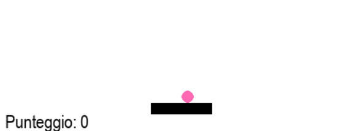

# Lezione 3: Creare il paddle e la pallina e far muovere il paddle

### Obiettivi della lezione

* Imparare a **creare il paddle e la pallina** usando `pygame.Rect`
* Far muovere il paddle con le frecce sinistra e destra
* Limitare il movimento del paddle ai bordi della finestra
* Muovere la pallina insieme al paddle quando è ferma

## 1. Creare il paddle (la barra controllata dal giocatore)

```python
paddle = pygame.Rect((WIDTH - PADDLE_WIDTH) // 2, HEIGHT - 40, PADDLE_WIDTH, PADDLE_HEIGHT)
paddle_speed = 6
```

* `pygame.Rect(x, y, width, height)` crea un rettangolo.
* `x = (WIDTH - PADDLE_WIDTH) // 2`: posiziona il paddle orizzontalmente al centro.
* `y = HEIGHT - 40`: il paddle è vicino al bordo basso della finestra, a 40 pixel di distanza.
* `paddle_speed = 6` indica di quanti pixel si sposta il paddle ogni aggiornamento.

## 2. Creare la pallina (un rettangolo che contiene un cerchio)

```python
ball = pygame.Rect(paddle.centerx, paddle.top - BALL_RADIUS*2, BALL_RADIUS*2, BALL_RADIUS*2)
ball_dx = 4
ball_dy = -4
ball_active = False
```

* Anche la pallina è rappresentata come un rettangolo (`Rect`).
* `x = paddle.centerx`: la pallina è centrata orizzontalmente sopra il paddle.
* `y = paddle.top - BALL_RADIUS*2`: posizionata sopra il paddle, alla distanza di due raggi.
* `BALL_RADIUS = 8`: raggio della pallina; il rettangolo è largo e alto il doppio del raggio.
* `ball_dx` e `ball_dy` sono le velocità orizzontale e verticale.
* `ball_active` è False: la pallina è ferma finché non premi spazio.


---

## 3. Muovere il paddle con le frecce

Nel ciclo principale del gioco, rileviamo quali tasti sono premuti:

```python
keys = pygame.key.get_pressed()

if keys[pygame.K_LEFT] and paddle.left > 0:
    paddle.x -= paddle_speed
    if not ball_active:
        ball.x -= paddle_speed

if keys[pygame.K_RIGHT] and paddle.right < WIDTH:
    paddle.x += paddle_speed
    if not ball_active:
        ball.x += paddle_speed
```

* `pygame.key.get_pressed()` ritorna uno **stato di tutti i tasti** (premuti o no).
* `keys[pygame.K_LEFT]` e `keys[pygame.K_RIGHT]` controllano se le frecce sono premute.
* Condizioni `paddle.left > 0` e `paddle.right < WIDTH` **impediscono al paddle di uscire dalla finestra**.
* Se la pallina è ferma (`not ball_active`), si sposta insieme al paddle.

---

## 4. Disegnare paddle e pallina nello schermo

```python
pygame.draw.rect(screen, (0, 0, 0), paddle)  # paddle nero
pygame.draw.circle(screen, PINK, ball.center, BALL_RADIUS)  # pallina rosa
```
Mostra il paddle e la pallina nello schermo.

---

## 5. Challenge

* Modifica la velocità `paddle_speed` durante il gioco con i tasti `A` e `D`:

---


