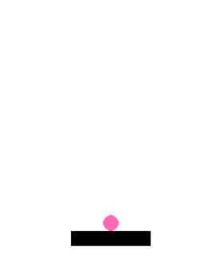
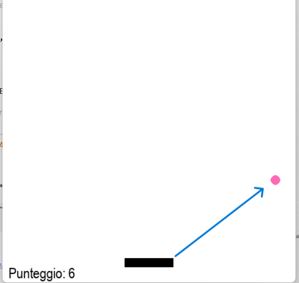
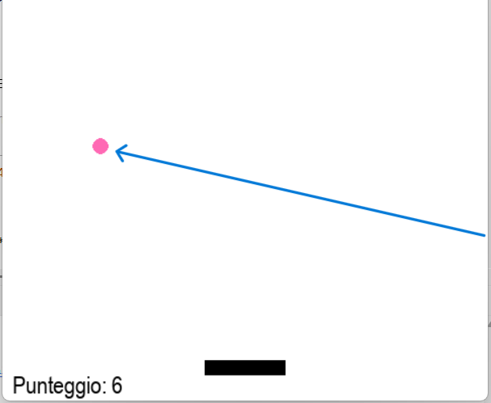

# Lezione 4 — Aggiungere la pallina

 

## Obiettivo della lezione
> In questa lezione aggiungeremo la pallina al nostro gioco Breakout.  
> Impareremo a:
> - Posizionare la pallina sopra il paddle  
> - Farla muovere automaticamente  
> - Gestire i rimbalzi sui muri e sul paddle  
> - Creare un effetto angolare nei rimbalzi  
>
> Alla fine, avremo una pallina che rimbalza nello schermo come nel vero gioco.

---

## Concetti chiave

---

### 1. Creare la pallina
> La pallina può essere rappresentata con un oggetto `pygame.Rect`, come il paddle.  
> La posizioniamo inizialmente sopra il paddle:
>
> ```python
> BALL_RADIUS = 8
> ball = pygame.Rect(paddle.centerx, paddle.top - BALL_RADIUS*2, BALL_RADIUS*2, BALL_RADIUS*2)
> ```
>
> Impostiamo anche due variabili per controllare la direzione:
>
> ```python
> ball_dx = 4   # movimento orizzontale
> ball_dy = -4  # movimento verticale
> ball_active = False  # la pallina è ferma finché non premi SPAZIO
> ```

---

### 2. Far partire la pallina
> Usiamo l’evento `pygame.KEYDOWN` per controllare quando il giocatore preme la **barra spaziatrice**.  
> Quando ciò accade, la pallina diventa "attiva" e comincia a muoversi:
>
> ```python
> for event in pygame.event.get():
>     if event.type == pygame.QUIT:
>         running = False
>     if event.type == pygame.KEYDOWN and event.key == pygame.K_SPACE:
>         if not ball_active:
>             ball_active = True
> ```

 

---

### 3. Movimento automatico della pallina
> Se `ball_active` è `True`, la pallina si sposta ad ogni ciclo:
>
> ```python
> if ball_active:
>     ball.x += ball_dx
>     ball.y += ball_dy
> ```
>
> In questo modo la pallina si muove costantemente, seguendo la direzione indicata da `ball_dx` e `ball_dy`.

---

### 4. Rimbalzo sui bordi
> Quando la pallina tocca il bordo sinistro, destro o superiore, deve rimbalzare.  
> Basta invertire il segno della velocità:
>
> ```python
> if ball.left <= 0 or ball.right >= WIDTH:
>     ball_dx *= -1
> if ball.top <= 0:
>     ball_dy *= -1
> ```
>
> Se invece tocca il fondo dello schermo, la rimettiamo sopra il paddle:
>
> ```python
> if ball.bottom >= HEIGHT:
>     ball_active = False
>     ball.x = paddle.centerx - BALL_RADIUS
>     ball.y = paddle.top - BALL_RADIUS*2
> ```

 

---

### 5. Rimbalzo sul paddle
> Quando la pallina colpisce il paddle, deve invertire la direzione verticale.  
> Possiamo anche aggiungere un effetto angolare, modificando la direzione orizzontale in base a dove colpisce:
>
> ```python
> if ball.colliderect(paddle):
>     ball_dy *= -1
>     offset = (ball.centerx - paddle.centerx) / (PADDLE_WIDTH / 2)
>     ball_dx = BALL_RADIUS * offset * 1.5
> ```

---

### 6. Disegnare la pallina
> Dopo aver aggiornato la sua posizione, disegniamo la pallina nello schermo:
>
> ```python
> PINK = (255, 105, 180)
> pygame.draw.circle(screen, PINK, ball.center, BALL_RADIUS)
> ```
>
> In questo esempio usiamo un colore rosa, ma puoi cambiarlo come preferisci.

---
## Challenge

# 🎯 Sfida: Aggiungi le Palline

Muovi il paddle, lancia la pallina con **SPAZIO**  
e premi **X** per aggiungerne altre!  
Riesci a tenerle tutte in gioco?

```python
import pygame
pygame.init()

# Crea finestra e paddle
screen = pygame.display.set_mode((800, 600))
paddle = pygame.Rect(350, 550, 100, 15)

# Prima pallina
ball = pygame.Rect(395, 530, 10, 10)
balls = [ball]  # lista di palline
