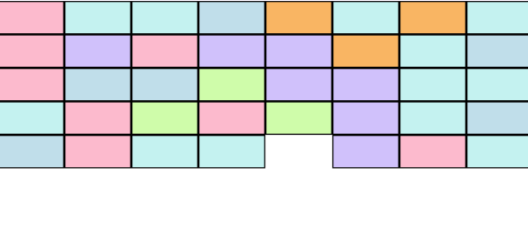
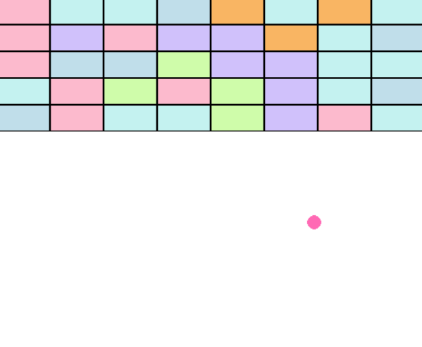
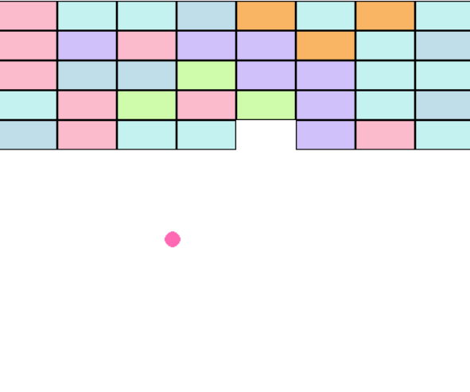
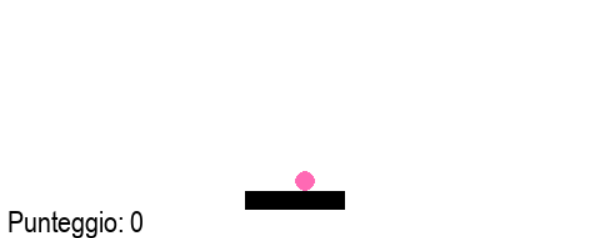
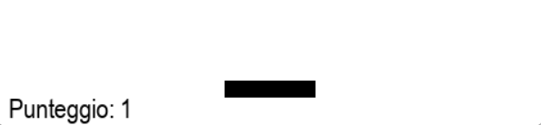

# Lezione 5 — Collisione con i blocchi e punteggio

## Obiettivo dell’esercizio

Implementare la collisione tra la pallina e i blocchi, in modo che:

* Quando la pallina tocca un blocco, il blocco viene **rimosso** e la pallina **rimbalza**.
* Il giocatore **guadagna punti** per ogni blocco distrutto.
* Il **punteggio** è visibile in tempo reale nella finestra di gioco.

---

## Concetti chiave

### 1. Collisione tra pallina e blocchi

Pygame permette di controllare facilmente le collisioni con il metodo:

```python
if ball.colliderect(block['rect']):
```

Cioe “se la pallina tocca il rettangolo del blocco”.

---

### 2. Rimozione del blocco colpito


Una volta percepita la collisione, il blocco viene **rimosso** dalla lista `blocks`:

```python
blocks.remove(block)
```

In questo modo il blocco non verrà più disegnato.

---

### 3. Rimbalzo della pallina




Quando la pallina colpisce un blocco, invertiamo la direzione verticale con `ball_dy`:

```python
ball_dy *= -1
```

Questo fa rimbalzare la pallina verso il basso o verso l’alto.

---

### 4. Aumento del punteggio




Ogni volta che un blocco viene distrutto, il punteggio cresce:

```python
score += 1
```

Puoi visualizzarlo con `font.render()` in una posizione stabilita:

```python
score_text = font.render(f"Punteggio: {score}", True, (0, 0, 0))
screen.blit(score_text, (10, HEIGHT - 30))
```

---

## Sfide aggiuntive

Se vuoi approfondire, prova a:

1. **Blocchi speciali che danno più punti**

   Assegna un valore diverso a certi blocchi, ad esempio:

   ```python
   score += 5
   ```

   se il blocco ha un colore speciale.

2. **Blocchi che raddoppiano la pallina**

   Quando colpiti, creano una seconda pallina che si muove indipendentemente.

4. **Effetti sonori**

   Aggiungi un suono quando un blocco viene distrutto (usando `pygame.mixer.Sound`).

---
